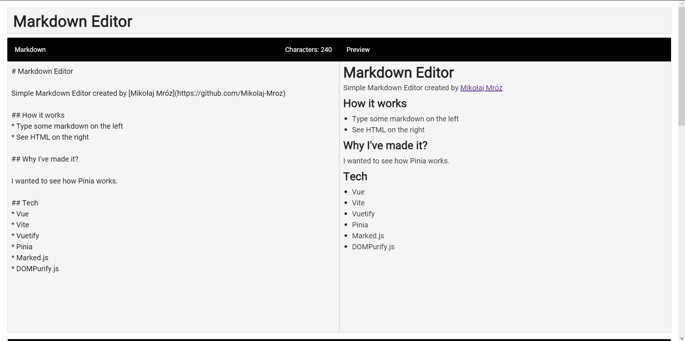

# Markdown Editor

Simple Markdown Editor created by [Mikołaj Mróz](https://github.com/Mikolaj-Mroz)  
You can check it out [here!](https://mikolaj-mroz.github.io/vue-markdown-editor/)

## How it works
* Type some markdown on the left
* See HTML on the right

## Why I've made it?

I wanted to see how Pinia works.

## Tech
* Vue
* Vite
* Vuetify
* Pinia
* Marked.js
* DOMPurify.js
